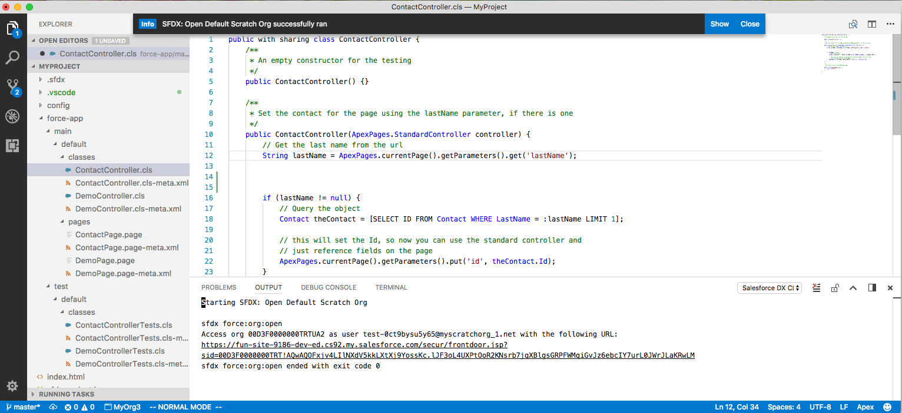
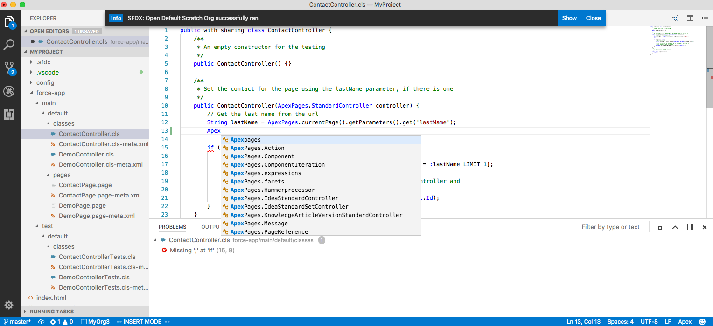
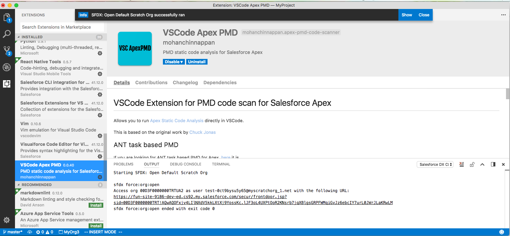

## Yeoman generator for SFDX

### Usage Demo

```
$ yo sfdx
```


## Project folder structure

```
$ tree MyProject/
MyProject/
├── config
│   └── scratch-org-def.json
├── force-app
│   ├── main
│   │   └── default
│   │       ├── classes
│   │       │   ├── ContactController.cls
│   │       │   ├── ContactController.cls-meta.xml
│   │       │   ├── DemoController.cls
│   │       │   └── DemoController.cls-meta.xml
│   │       └── pages
│   │           ├── ContactPage.page
│   │           ├── ContactPage.page-meta.xml
│   │           ├── DemoPage.page
│   │           └── DemoPage.page-meta.xml
│   └── test
│       └── default
│           └── classes
│               ├── ContactControllerTests.cls
│               ├── ContactControllerTests.cls-meta.xml
│               ├── DemoControllerTests.cls
│               └── DemoControllerTests.cls-meta.xml
├── index.html
└── sfdx-project.json

9 directories, 15 files

```

## Edit with VS


```
$ cd MyProject

$ code .


```





### Apex code completion




### Apex PMD code-scan extension for VS Code

