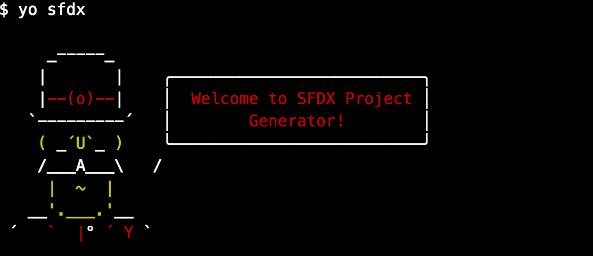

## Yeoman generator for SFDX



### Usage
```


$ yo sfdx


     _-----_
    |       |    ╭──────────────────────────╮
    |--(o)--|    │  Welcome to SFDX Project │
   `---------´   │        Generator!        │
    ( _´U`_ )    ╰──────────────────────────╯
    /___A___\   /
     |  ~  |
   __'.___.'__
 ´   `  |° ´ Y `

destinationRoot :/Users/mchinnappan/sfdc/sfdx/generator/generator-sfdx
/Users/mchinnappan/sfdc/sfdx/generator/generator-sfdx/package.json
/Users/mchinnappan/sfdc/sfdx/generator/generator-sfdx
template context: /Users/mchinnappan/sfdc/sfdx/generator/generator-sfdx/generators/app/templates
template file: /Users/mchinnappan/sfdc/sfdx/generator/generator-sfdx/generators/app/templates/index.html
destinationPath:/Users/mchinnappan/sfdc/sfdx/generator/generator-sfdx/public

? Project Name MyProject
? Github User Email mohan.chinnappan.n@gmail.com
? Scratch Org Name MyScratchOrg 1

? API version 38.0
? Apex Controller Name ContactController
? Visualforce Page Name ContactPage
=========================
prjName:  MyProject
githubUserEmail:  mohan.chinnappan.n@gmail.com
scratchOrgName:  MyScratchOrg 1
apiVersion:  38.0
apexCtrlName:  ContactController
vfPageName:  ContactPage
=========================
identical MyProject/force-app/main/default/classes/ContactController.cls
identical MyProject/force-app/main/default/classes/ContactController.cls-meta.xml
identical MyProject/force-app/main/default/pages/ContactPage.page
identical MyProject/force-app/main/default/pages/ContactPage.page-meta.xml
identical MyProject/force-app/test/default/classes/ContactControllerTests.cls
identical MyProject/force-app/test/default/classes/ContactControllerTests.cls-meta.xml
npm WARN generator-sfdx@0.1.0 No repository field.
npm WARN generator-sfdx@0.1.0 No license field.

+ lodash@4.17.4
updated 1 package in 1.613s
identical MyProject/index.html
identical MyProject/sfdx-project.json
identical MyProject/config/scratch-org-def.json
Your project is ready!


```

## Project folder structure

```
tree MyProject/
MyProject/
├── config
│   └── scratch-org-def.json
├── force-app
│   ├── main
│   │   └── default
│   │       ├── classes
│   │       │   ├── ContactController.cls
│   │       │   ├── ContactController.cls-meta.xml
│   │       │   ├── DemoController.cls
│   │       │   └── DemoController.cls-meta.xml
│   │       └── pages
│   │           ├── ContactPage.page
│   │           ├── ContactPage.page-meta.xml
│   │           ├── DemoPage.page
│   │           └── DemoPage.page-meta.xml
│   └── test
│       └── default
│           └── classes
│               ├── ContactControllerTests.cls
│               ├── ContactControllerTests.cls-meta.xml
│               ├── DemoControllerTests.cls
│               └── DemoControllerTests.cls-meta.xml
├── index.html
└── sfdx-project.json

9 directories, 15 files

```
